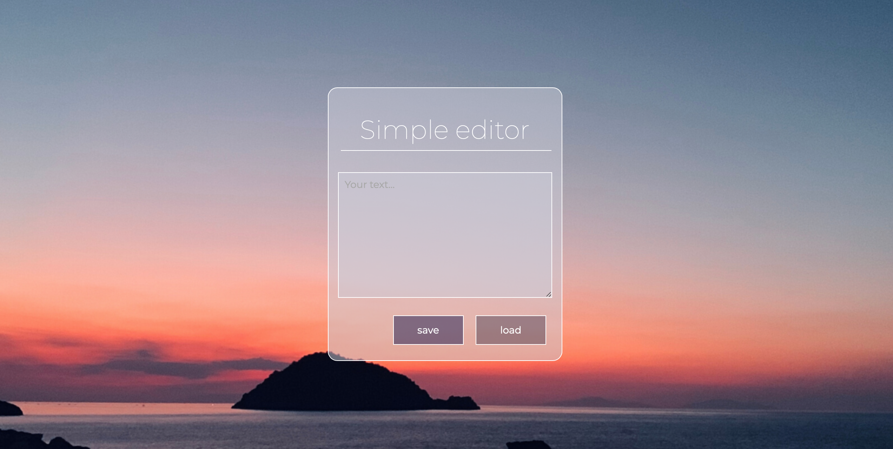

# The Simple editor with localStorage solution

## Tools and technology:
- Visual Studio Code
- JS: Fetch API
- Grid / Flex
- Sass
- BEM 
- Gulp
- Open Graph

### wtf-gulp-starter is necessary to run this webside
#### For this purpose:
`npm install -g gulp-cli`

`npm install`

`gulp`

To publish your page using github pages use `npm run deploy`
